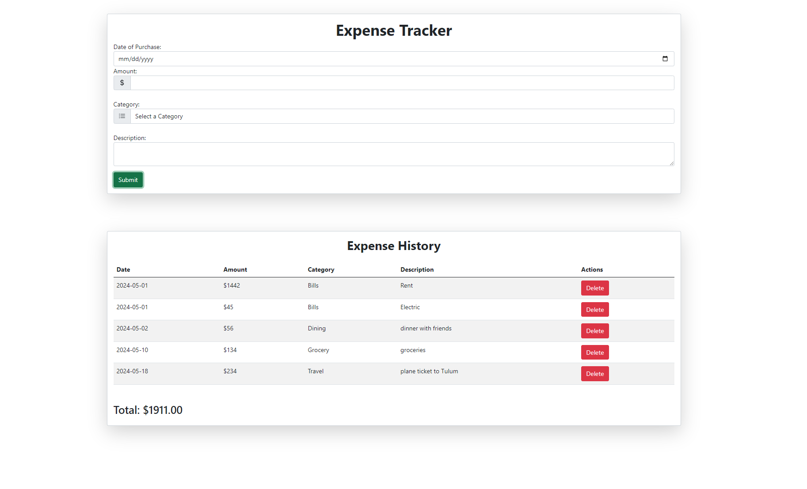

# React Expense Tracker

Expense Tracker created with Bootstrap/React

### Track Expenses [Here](https://kimdaby.github.io/React-Expense-Tracker/)

## Summary

The Expense Tracker application, developed using React, is a user-friendly tool designed to help individuals manage their expenses effectively. The application comprises two main components: the Form component for adding new expenses and the ExpenseList component for displaying and managing the list of recorded expenses.

The Form component utilizes the react-hook-form library to handle form submissions efficiently. It includes input fields for the date of purchase, amount, category, and description of the expense. Users can enter the required details and submit the form to add a new expense. The form is styled with Bootstrap classes to ensure a clean and modern appearance.

The ExpenseList component displays all the recorded expenses in a structured table format. Each expense entry includes the description, amount, category, and an option to delete the entry. The total amount of all recorded expenses is also displayed at the bottom of the list, providing users with a quick overview of their spending. This component is also styled using Bootstrap to match the form's aesthetic, ensuring a consistent look and feel throughout the application.

The state management is handled using React's useState hook, which maintains the list of expenses. The addItem function adds a new expense to the list, while the deleteItem function allows users to remove an expense. This simple yet effective expense tracker helps users keep track of their spending, categorize expenses, and manage their finances more efficiently.

## Author

David (Yun) Kim
